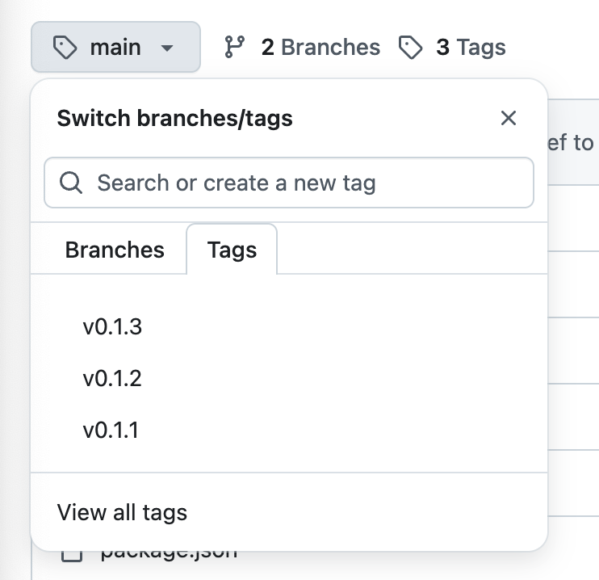

# iLab Web Components
## What is this?
This is a repository for reusable, framework-agnostic web components for use inside [Shorthand](https://shorthand.com/) and other CSIS digital projects. Built with [Svelte 5 custom elements](https://svelte.dev/docs/svelte/custom-elements).

## Project Structure
```
/dist
  widgets.js   ← compiled bundle (do not edit manually)
/src
  /Widget1.svelte
  /Widget2.svelte
  /Widget3.svelte
  ...
.gitignore
.index.html   ← use for testing
package.json
README.md
svelte.config.js
vite.config.js
```

## Development
### Requirements
- Node 20+
- npm

### Install dependencies
```
npm install
```

### Start local dev server
```
npm run dev
```
This opens a local playground at `localhost:5173` where you can test your components.

### Test components
In local development, before building the new distro file, test your component locally using the `index.html` file. 

1. Inside `src/main.js`, add your new component to the list of imports
2. Inside `index.html`, import `main.js`
   ```
   <script type="module" src="/src/main.js"></script>
   ```
3. Inside `<body>`, use your new component and test changing the various attributes.

### Build distro
Once you're happy with your local testing, build the new `widgets.js` file for use in Shorthand by running:
```
git pull origin main
npm run build
```
### Versioning and Tagging
All Shorthand embeds must reference a *version tag* (not @main). Each tag corresponds to a stable `/dist/widgets.js` build. 

This provides several benefits:
1. **Gets arround problems caused by [jsdelivr](https://www.jsdelivr.com/)'s hard caching.** Even though we've updated the `widgets.js` file, these changes might not show up because the CDN has cached an old version. 
2. **Provides stability for Shorthand use.** Shorthand stories are single page sites that are not updated or maintained after release. If we used versioned releases, we can continue to work on updates and update `widgets.js` knowing that these updates won't break any stories that have used an older version. 
3. **Gives a fallback.** If something breaks later, we can roll back to a good version. 
4. **Easier debugging.** If we get bug reports or features requests, we know exactly which code is being referred to.

## Making commits
Once you're happy with your component, you need to create a new release. After running `npm run build`, check what the most recent tag/version is, then run:
``` 
git add .
git commit -m "Build v0.1.5 - [short message]" (use most current version #)
git tag -a v0.1.5 -m "v0.1.5 - [short message]"
git push origin main
git push origin v0.1.5
```

## Tags
The commit and tag need to be pushed separatel and you must always use an incremented tag. If you aren't sure what the most recent tag is, run:
```
git tag
```
To see details about a specific tag:
```
git show [version #]
```
Fetch any tags from remote if you don't see the latest:
```
git fetch --tags
```
You can also look at the tags on Github by going to the repo, clicking `main` to see the branches and tags, and clicking on the `Tags` tab.


